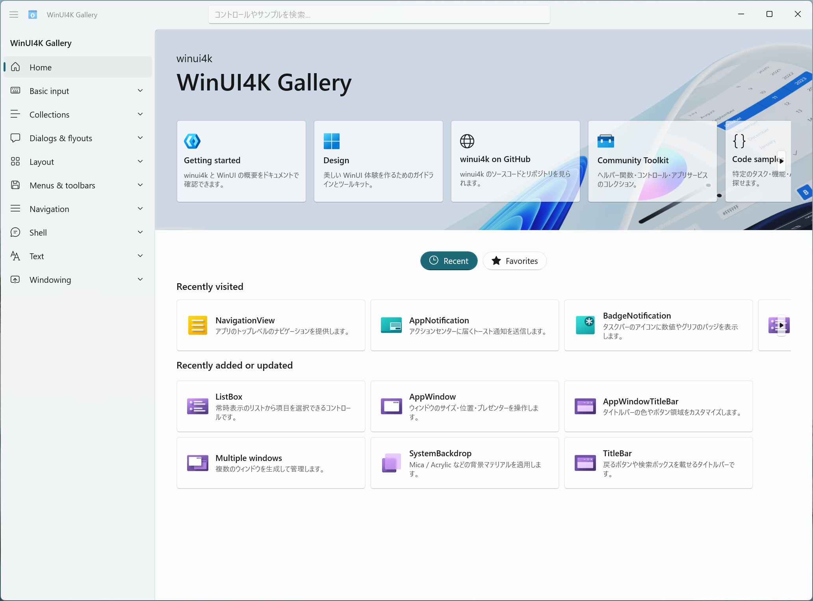

# WinUI for Kotlin & Java (winui4k)

[](https://github.com/nttr-tech/winui4k/actions/workflows/build.yml)
[](LICENSE.txt)


[English](README.md) | 日本語

**WinUI** は、Microsoft が Windows 11 世代の標準として推進する UI フレームワークです。
**WinUI4K** を使うと、ブリッジ DLL も C# も Visual Studio も使わずに、Kotlin や Java だけで WinUI を使った Windows ネイティブアプリを作れます。
WinUI4K は Java の FFI (Panama / JNA / JNR) から WinRT ABI (バイナリレベルの呼び出し規約) を直接呼び出すため、言語とランタイムの間の橋渡し用ネイティブ DLL を同梱する必要がありません。

[NTTレゾナントテクノロジー](https://nttr-tech.co.jp/)が提供する、インターネット経由でスマートフォン実機を借りられるサービス「[Remote TestKit](https://appkitbox.com/)」の PC クライアント向けに活かすことを一つの目的として試作したライブラリです。
Apache License 2.0 で公開しており、商用か非商用かを問わず自由に利用できます。

下のスクリーンショットは Microsoft 製の WinUI 3 Gallery に見えますが、すべて Kotlin で書かれた同梱の [Gallery アプリ](winui4k-sample-gallery) です。



## 目次

- [背景](#背景)
- [使用例](#使用例)
- [特徴](#特徴)
- [従来のWinUI開発との比較](#従来のwinui開発との比較)
- [向いている用途と制約](#向いている用途と制約)
- [クイックスタート](#クイックスタート)
- [サンプルアプリ](#サンプルアプリ)
- [モジュール構成](#モジュール構成)
- [アーキテクチャ](#アーキテクチャ)
- [Windows App SDK ランタイムの自動セットアップ](#windows-app-sdk-ランタイムの自動セットアップ)
- [システムプロパティ](#システムプロパティ)
- [コントリビューション](#コントリビューション)
- [ライセンス](#ライセンス)
- [参考情報](#参考情報)

## 背景

Microsoft は WinUI を今後の Windows アプリ UI の中心に据えており、Windows 標準アプリの一部もすでに WinUI へ移行しています。
一方で WinUI が公式に想定する開発言語は C++ と C# であり、業務システムで広く使われている Java や Kotlin から実用的に扱う手段は、これまでほとんどありませんでした。

このため、Java や Kotlin の資産を持つ現場が Windows のネイティブ UI を採用するには、C# への全面的な書き換えか、Web 技術でデスクトップアプリを作る Electron のような別方式への移行が必要でした。
Compose for Desktop という選択肢もありますが、独自の描画エンジンを使う非ネイティブ方式のため、OS 標準の見た目とアクセシビリティをそのまま得ることはできません。
winui4k は、JVM の FFI で WinUI を直接呼び出すことで、この空白を埋めるために作られました。

## 使用例

Java の Swing のような使い心地で WinUI アプリを実装できます。

```kotlin
WinUiUtilities.invokeLater {
    val frame = WFrame(title = "WinUI4K")
    val nameField = WTextField(placeholder = "Name")
    val greetButton = WButton("Greet")

    greetButton.addActionListener {
        greetButton.text = "Hello, ${nameField.text.ifBlank { "world" }}!"
    }

    frame.add(nameField)
    frame.add(greetButton)
    frame.isVisible = true
}
```

この短いコードで、ネイティブの Windows ウィンドウが開き、ボタンを押すとその文字が書き換わります。

## 特徴

- **60 超のコントロール**：Button / TextBox から NavigationView、TeachingTip、AppNotification、AppWindow まで `W*` クラスとしてラップ済みです。Gallery で全部試せます。
- **Java 8 から動作**：FFI バックエンドは差し替え式です。Panama (Java 22 以降、既定)、JNA (Java 8 以降)、JNR (Java 8 以降) の 3 実装を同梱します。
- **コルーチン対応**：`Dispatchers.WinUi` (winui4k-extension-coroutines) で UI スレッドへディスパッチでき、`delay` はネイティブのタイマー (DispatcherQueueTimer) で動きます。
- **WebView2 対応**：`WWebView` で Microsoft Edge ベースのブラウザコントロールをアプリに埋め込めます。
- **アクセシビリティ**：OS 標準のコントロールをそのまま使うため、スクリーンリーダーなどの支援技術がそのまま働きます。
- **実機での E2E テスト**：テストは実際に WinUI ウィンドウを起動して検証し、CI では JDK 8 / 9 / 22 / 25 で実行しています。
- **ブリッジ DLL 不要**：オブジェクト生成 (`RoGetActivationFactory`) から、WinUI の文字列型 HSTRING、関数テーブル (vtable) 経由のメソッド呼び出し、Kotlin オブジェクトを COM オブジェクトとして見せる upcall、COM 集約まで、JVM の FFI だけで実装しています ([アーキテクチャ](#アーキテクチャ))。
- **推測値ゼロの ABI 定数**：COM 呼び出しに必要な識別子 (IID) と vtable 上の位置は、すべて Windows の型情報ファイル (winmd) から機械抽出した値で、手書きの推測値を含みません。

## 従来のWinUI開発との比較

| 観点 | 従来のWinUI開発 | winui4k |
|---|---|---|
| 開発言語 | C# / C++ と画面記述言語 XAML | Kotlin / Java (画面もコードで記述) |
| 開発環境 | Visual Studio を使うのが一般的 | 任意のエディタ + JDK |
| 追加ランタイム/SDK | .NET SDK、Windows App SDK ランタイム | Windows App SDK ランタイムのみ (未導入なら起動時に自動インストール) |
| 独自ブリッジDLL | 場合により必要 | 不要 |
| 既存のJVM資産 | C#への書き換えが必要 | そのまま活用できる |

上表は一般的な開発手法との比較であり、構成によっては当てはまらない場合があります。

## 向いている用途と制約

次のような場合に向いています。

- Swing や JavaFX で作った Windows 業務アプリの画面を、OS ネイティブの Fluent Design (Windows 11 標準のデザイン言語) に刷新したい
- Java 8 で動かす必要のある環境で、Windows のネイティブ UI を使いたい
- Electron のようなブラウザエンジン同梱方式による配布サイズとメモリ使用量の増加を避けたい
- 独自描画方式ではなく、OS 標準コントロールの見た目とアクセシビリティが必要

一方、次の制約があります。

- **Windows 専用**です。WinUI 自体が Windows 専用のため、macOS や Linux を含むクロスプラットフォーム対応が必要な場合は Compose Multiplatform などを検討してください。
- **COM 参照の解放は GC 連動**で、タイミングは非決定的です。UI 要素を高頻度に生成と破棄を繰り返しつつ、ネイティブ側の解放タイミングを厳密に制御したい用途では、この前提を踏まえた設計が必要です ([アーキテクチャ](#アーキテクチャ))。
- **言語境界をまたぐ循環参照は自動回収されません**。不要になったイベントリスナーは remove 系メソッドで明示的に解除する運用が前提です。

## クイックスタート

必要なのは **JDK 25** (x64) だけです (Visual Studio、C++ ビルドツール、.NET SDK は不要)。
[Eclipse Temurin](https://adoptium.net/) などから入手してパスに設定してください。

```powershell
git clone https://github.com/nttr-tech/winui4k.git
cd winui4k
.\gradlew run
```

これで Gallery アプリが起動します。
WinUI の実行基盤 (Windows App SDK ランタイム) が未導入でも、起動時に自動でセットアップされます ([詳細](#windows-app-sdk-ランタイムの自動セットアップ))。

JDK 25 が必要なのはリポジトリのビルドで、ライブラリ自体の動作要件は Java 8 以降です。
Java 8 + JNA での起動は `.\gradlew :winui4k-sample-gallery:runJna`、Java 8 + JNR での起動は `.\gradlew :winui4k-sample-gallery:runJnr` で確認できます。

動作環境は Windows 11 x64 です (Windows 10 1809 以降でも動く想定)。

## サンプルアプリ

Gallery に加えて、実用に近いサンプルアプリを複数同梱しています。
いずれも WinUI4K で実際のアプリが組めることを示すために用意しています。

| サンプル | 内容 | 起動コマンド |
|---|---|---|
| [Gallery](winui4k-sample-gallery) | 60超のコントロールをカテゴリ別に一覧できるデモアプリ (WinUI 3 Gallery 風) | `.\gradlew run` |
| [Filer](winui4k-sample-filer) | Fluent Design のファイラー。タブ、詳細表示とアイコン表示の切り替え、ブレッドクラム、サイドバー、フィルターを備える | `.\gradlew :winui4k-sample-filer:run` |
| [Notes](winui4k-sample-notes) | シンプルなメモ帳アプリ | `.\gradlew :winui4k-sample-notes:run` |
| [Form with MigLayout](winui4k-sample-form-with-miglayout) | レイアウトライブラリ MigLayout を使った入力フォーム | `.\gradlew :winui4k-sample-form-with-miglayout:run` |

## モジュール構成

| モジュール | 内容 |
|---|---|
| `winui4k` | 本体。公開 API (`W*` クラス) と COM / WinRT / WinUI の内部レイヤ |
| `winui4k-ffi-panama` | Panama (`java.lang.foreign`) FFI バックエンド。Java 22 以降 |
| `winui4k-ffi-jna` | JNA FFI バックエンド。Java 8 以降 (x64 のみ) |
| `winui4k-ffi-jnr` | JNR (jffi) FFI バックエンド。Java 8 以降 (x86 / x64 / arm64) |
| `winui4k-extension-coroutines` | `Dispatchers.WinUi` (kotlinx-coroutines-swing の WinUI 版) |
| `winui4k-extension-miglayout` | レイアウトライブラリ MigLayout で `W*` コントロールを配置するためのアダプタ |
| `winui4k-all` | 上記モジュール (サンプルを除く) を一括参照する集約モジュール |
| `winui4k-sample-gallery` | 全コントロールのデモアプリ |
| `winui4k-sample-filer` | Fluent Design のファイラーサンプル |
| `winui4k-sample-notes` | メモ帳アプリのサンプル |
| `winui4k-sample-form-with-miglayout` | MigLayout を使った入力フォームのサンプル |

## アーキテクチャ

winui4k は、Java の FFI で **COM** (言語をまたいでオブジェクトを呼び出すための、Windows がバイナリレベルで定めた規約) を直接操作し、その発展形である **WinRT** (Windows のモダン API 基盤) 上の WinUI を呼び出します。

COM オブジェクトへの参照は、関数ポインタの配列 (**vtable**) へのポインタを先頭に持つ構造体へのポインタです。
`ポインタ → vtable → vtable[スロット番号]` とたどるとメソッドの実体に到達する、C++ の仮想関数呼び出しと同じ仕組みです。
WinUI の Button や Window はこの形でプロセス内に存在しており、winui4k は FFI でこの呼び出しを直接組み立てます。

レイヤは一方向に依存します。

| レイヤ | パッケージ | 役割 |
|---|---|---|
| 公開 API | `com.appkitbox.winui4k` | `W*` クラス (`WFrame` / `WButton` / ...) |
| WinUI | `internal.winui` | ABI 定数の `*Interop`、Dispatcher |
| WinRT | `internal.winrt` | HSTRING、`KComObject` (Kotlin 実装を COM オブジェクトとして見せる upcall スタブ)、Activation |
| COM | `internal.com` | `ComPtr`、Guid、HRESULT (COM の呼び出し結果コード) の例外化 |
| FFI SPI | `internal.ffi.api` | バックエンド非依存の FFI 語彙。実装は ServiceLoader で発見 |

FFI バックエンドは別モジュールとして分離されており、実行時に ServiceLoader で発見して選択します。
優先度は Panama (Java 22 以降の既定) > JNA (Java 8 以降、x64 専用) > JNR (Java 8 以降、x86 / x64 / arm64) で、`-Dwinui4k.ffi` による明示指定もできます。
コアモジュールは Java 8 ターゲットで、`java.lang.foreign` への参照は Panama モジュールだけが持ちます。

### COM 参照と GC の橋渡し

COM は参照カウント (`AddRef` / `Release`) で寿命を管理しますが、JVM はトレース型 GC で到達可能性から寿命を決めます。
winui4k はこのミスマッチを、Microsoft 公式の C# 向け相互運用ランタイム **CsWinRT** と同じ設計で橋渡しします。
`W*` ラッパー 1 個に COM 参照カウント 1 つ分の所有権を対応付け、GC がラッパーの到達不能を検出したときに `Release` を呼びます (Java 9 以降は `java.lang.ref.Cleaner`、Java 8 は `PhantomReference` による同等の自作機構)。

COM には **アパートメント** というスレッド規約があり、WinUI のオブジェクトは UI スレッドに束縛されていて、`Release` もそのスレッドから呼ぶ必要があります。
このため GC 由来の解放は、UI スレッドのメッセージループへ集約して実行します。

なお、言語境界をまたぐ循環参照 (ネイティブ → Kotlin 実装のイベントハンドラ → Kotlin オブジェクト → ネイティブへの COM 参照) は自動回収できません。
CsWinRT は .NET GC と WinUI ランタイムの参照グラフ相互照会で解決していますが、JVM の GC には相当する拡張点がないためです。

### 既知の制約

- UI スレッドは 1 本が前提で、`W*` API はこのスレッド上でのみ使う契約です。
- ウィンドウや Shell 系のラッパー (`WFrame`、`WAppWindow` など) は自動解放の対象外で、参照を保持し続けます。
- エラー処理は HRESULT の例外化のみです。

IID (インターフェース識別子) と vtable のスロット番号は手書きの推測値ではなく、Windows の型情報ファイル (winmd) から `tools/dump_winmd.py` で機械抽出した値です。

## Windows App SDK ランタイムの自動セットアップ

WinUI の実行基盤である Windows App SDK ランタイムを、WinUI4K はアプリ起動時に自動でセットアップします。

### ブートストラップ DLL

Windows App SDK の初期化に必要なブートストラップ DLL (`Microsoft.WindowsAppRuntime.Bootstrap.dll`) は winui4k の JAR に内蔵されています (x86 / x64 / arm64 の 3 アーキテクチャ対応)。
`WinUiUtilities` の初回呼び出し時に、実行中の PC アーキテクチャに合った DLL が一時ディレクトリへ自動展開され、プロセス終了時に削除されます。

### ランタイムのインストール

Windows App SDK 2.2 ランタイムが必要です。未インストールの場合は以下の順に対応します。

1. **インストーラーの自動実行**：カレントディレクトリ (または `winui4k.installer.dir` で指定したディレクトリ) に `WindowsAppRuntimeInstall-x64.exe` 等のインストーラーがあれば、`--quiet` オプションでサイレントインストールを実行し、アプリをそのまま起動します
2. **インストールダイアログの表示**：インストーラーが見つからない場合は、Microsoft のダイアログが表示され、ユーザーにランタイムのダウンロードを促します

インストーラーは以下のコマンドでダウンロードできます。

```powershell
.\gradlew :winui4k:downloadInstallers
```

`winui4k/installer/` に x86 / x64 / arm64 の 3 種類がダウンロードされます (各約 104 MB)。
アプリ配布時にアーキテクチャに合ったインストーラーを同梱すれば、エンドユーザーの環境にランタイムが自動インストールされます。

手動でインストールする場合は https://aka.ms/windowsappsdk から `WindowsAppRuntimeInstall-x64.exe` を実行してください。

## システムプロパティ

| プロパティ | 値 | 説明 |
|---|---|---|
| `winui4k.ffi` | `panama` / `jna` / `jnr` | FFI バックエンドの明示指定。既定は利用可能なもののうち優先度最大 |
| `winui4k.lifetime` | `cleaner` / `phantom` | COM 参照の後始末機構の明示指定。既定は Java バージョンで自動選択 |
| `winui4k.gcThreshold` | 整数 (参照数) | 生存中のネイティブ参照数が閾値を超えるたびに `System.gc()` を要請する。既定は無効 |
| `winui4k.bootstrap.dll` | パス | ブートストラップ DLL を JAR 内蔵版の代わりに明示指定 |
| `winui4k.installer.dir` | ディレクトリ | ランタイムインストーラーの検索先。絶対パスと相対パスの両方に対応 (既定はカレントディレクトリ) |

## コントリビューション

不具合報告や機能要望、プルリクエストは GitHub の Issue で受け付けています。

## ライセンス

[Apache License 2.0](LICENSE.txt) です。商用か非商用かを問わず自由に利用できます。

## 参考情報

- [WinUI 開発ドキュメント](https://learn.microsoft.com/ja-jp/windows/apps/winui/winui3/)
   - [Fluent Design System](https://fluent2.microsoft.design/)
   - [Windows アプリの設計の概要](https://learn.microsoft.com/ja-jp/windows/apps/design/)

- [WinUI リポジトリ](https://github.com/microsoft/microsoft-ui-xaml)
   - [WinUI Gallery リポジトリ](https://github.com/microsoft/WinUI-Gallery)
   - [Windows App SDK リポジトリ](https://github.com/microsoft/WindowsAppSDK)
   - [nuget](https://www.nuget.org/packages/Microsoft.WindowsAppSDK)
- WinUI追加コンポーネント
   - [TableView リポジトリ](https://github.com/w-ahmad/WinUI.TableView)
   - [Community Controls リポジトリ](https://github.com/CommunityToolkit/Windows)
