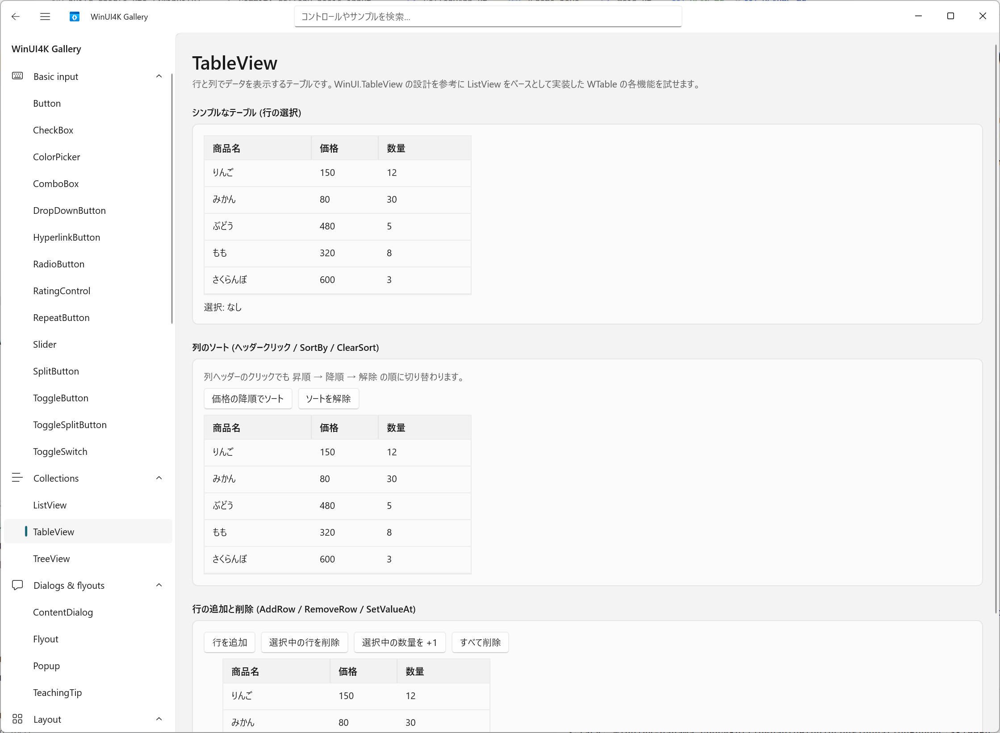

# WinUI for Kotlin & Java (winui4kプロジェクト)

ブリッジ DLL も C# も Visual Studio も使わずに WinUI を使ったアプリを作れる Kotlin ライブラリです。
Java の FFI (Panama / JNA / JNR) で WinRT ABI + COM + Win32 を直接呼び出すので軽量で安定しています。

[NTTレゾナントテクノロジー](https://nttr-tech.co.jp/)が提供しているインターネット経由でスマホを借りられるサービス「[Remote TestKit](https://appkitbox.com/)」のPCクライアント用に試作しました。

Apache Licenseですので商用・非商用を問わずにご自由に利用いただけます。

下のスクリーンショットは Microsoft 製の WinUI 3 Gallery ではありません。
**すべて Kotlin で書かれた** 同梱の Gallery アプリ ([winui4k-sample-gallery](winui4k-sample-gallery/)) です。



## 利用例

`SwingUtilities.invokeLater` と同じ感覚で書けます。

```kotlin
WinUiUtilities.invokeLater {
    val frame = WFrame(title = "WinUI for Kotlin Demo")
    val nameField = WTextField(placeholder = "お名前をどうぞ")
    val greetButton = WButton("Greet")

    greetButton.addActionListener {
        greetButton.text = "Hello, ${nameField.text.ifBlank { "world" }}!"
    }

    frame.add(nameField)
    frame.add(greetButton)
    frame.isVisible = true
}
```

## 特徴

- **ブリッジ DLL なし**：`RoGetActivationFactory`、HSTRING、vtable 呼び出し、upcall による COM オブジェクト実装、COM 集約まで、WinRT の COM ABI を JVM の FFI だけで扱います
- **60 超のコントロール**：Button / TextBox から NavigationView、TeachingTip、AppNotification、AppWindow まで `W*` クラスとしてラップ済み。Gallery で全部試せます
- **Java 8 でも動く**：FFI バックエンドは差し替え式。Panama (Java 22 以降、既定)、JNA (Java 8 以降)、JNR (Java 8 以降) の 3 実装を同梱します
- **コルーチン対応**：`Dispatchers.WinUi` (winui4k-coroutines) で UI スレッドへディスパッチし、`delay` は DispatcherQueueTimer にネイティブ対応します
- **推測値ゼロの ABI**：IID と vtable スロットはすべて winmd から機械抽出した値です ([doc/architecture.md](doc/architecture.md))

## 起動

必要なのは次の 2 つだけです (Visual Studio、C++ ビルドツール、.NET SDK は不要)。

1. **JDK 25** (x64)：[Eclipse Temurin](https://adoptium.net/) などから入手してパスに設定します
2. **Windows App SDK 2.2 ランタイム**：https://aka.ms/windowsappsdk から `WindowsAppRuntimeInstall-x64.exe` を実行します
   (未インストールでも起動時にインストールを促すダイアログが出ます)

```powershell
.\gradlew run
```

これで Gallery が起動します。
初回は Gradle と NuGet パッケージ (ブートストラップ DLL、約 6 MB) を自動取得します。
Java 8 + JNA での起動は `.\gradlew :winui4k-sample-gallery:runJna`、Java 8 + JNR での起動は `.\gradlew :winui4k-sample-gallery:runJnr` で確認できます。

動作環境は Windows 11 x64 です (Windows 10 1809 以降でも動く想定)。

## モジュール構成

| モジュール | 内容 |
|---|---|
| `winui4k` | 本体。公開 API (`W*` クラス) と COM / WinRT / WinUI の内部レイヤ |
| `winui4k-panama` | Panama (`java.lang.foreign`) FFI バックエンド。Java 22 以降 |
| `winui4k-jna` | JNA FFI バックエンド。Java 8 以降 (x64 のみ) |
| `winui4k-jnr` | JNR (jffi) FFI バックエンド。Java 8 以降 |
| `winui4k-coroutines` | `Dispatchers.WinUi` (kotlinx-coroutines-swing の WinUI 版) |
| `winui4k-sample-gallery` | 全コントロールのデモアプリ (WinUI 3 Gallery 風) |

# 参考情報

- [WinUI 開発ドキュメント](https://learn.microsoft.com/ja-jp/windows/apps/winui/winui3/)
   - [Fluent Design System](https://fluent2.microsoft.design/)
   - [Windows アプリの設計の概要](https://learn.microsoft.com/ja-jp/windows/apps/design/)

- [WinUI リポジトリ](https://github.com/microsoft/microsoft-ui-xaml)
   - [WinUI Gallery リポジトリ](https://github.com/microsoft/WinUI-Gallery)
   - [Windows App SDK リポジトリ](https://github.com/microsoft/WindowsAppSDK)
- WinUI追加コンポーネント
   - [TableView リポジトリ](https://github.com/w-ahmad/WinUI.TableView)
   - [Community Controls リポジトリ](https://github.com/CommunityToolkit/Windows)
